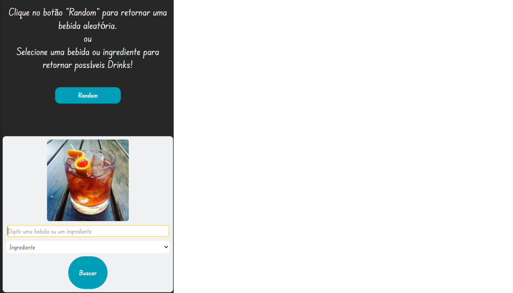
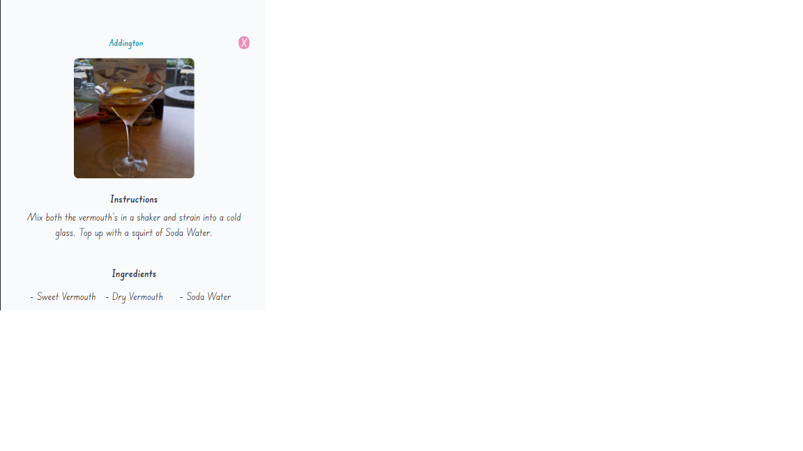
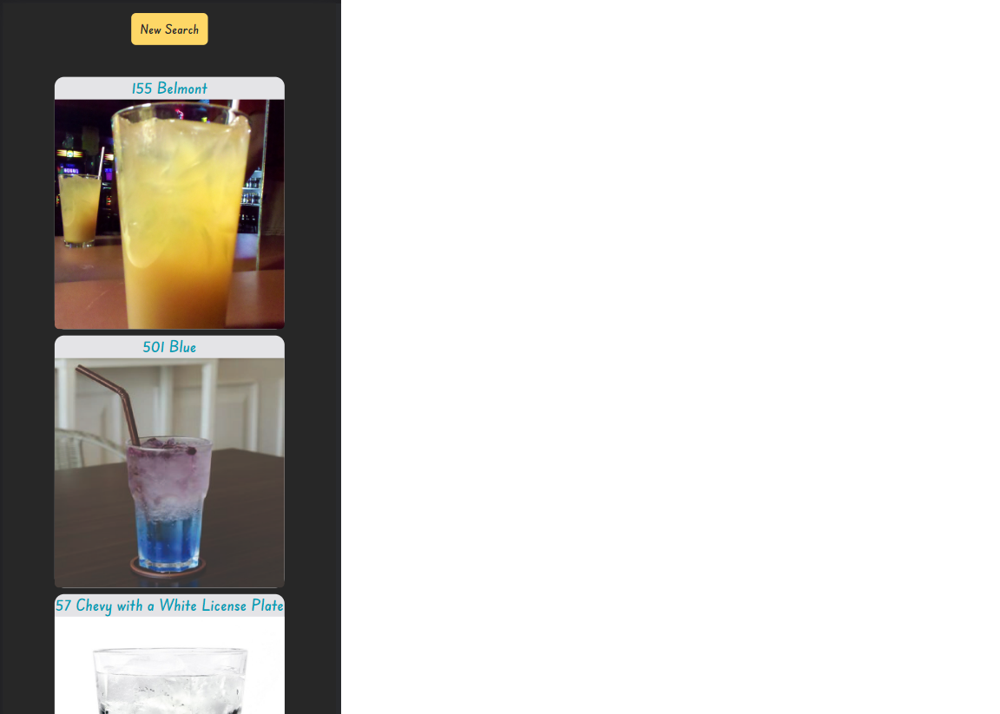

<h1 align="center">What a drink - Responsive version</h1>

 🚀 Estudo de React, Tailwindcss responsive module, AXIOS  

<h1 align="center"></h1>

•
 <a href="#objetivo">Objetivo</a> •
 <a href="#tecnologias">Tecnologias</a> • 
 <a href="#autor">Autor</a> •

<h1 align="center">
    
    
    
</h1>

## **Objetivo**

 🔍 Estudando React - primeira aplicação com a ferramenta 

## **Tecnologias**

<ul>

<li>🛠 React
<li>🛠 React Router
<li>🛠 Vite
<li>🛠 Axios
<li>🛠 API thecocktaildb
<li>🛠 Tailwindcss

</ul>

## **Autor**

 Desenvolvido por <a href="https://github.com/valtercfjunior">Valter Junior</a> 
